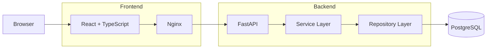

# Splitwise-like

<!-- ## Screenshots

| Dashboard | Group Details |
|-----------|--------------|
|  |  | -->

## Live Demo

https://splitwise-frontend-60c3.onrender.com

Swagger:
https://splitwise-backend-0edc.onrender.com/docs

> A production-ready full-stack expense sharing application inspired by Splitwise, built with **React**, **FastAPI**, **PostgreSQL**, **Docker**, and **GitHub Actions**, and deployed on **Render**.

---

## Overview

Expense Sharing Platform is a full-stack web application that helps groups track shared expenses and automatically calculate balances and settlement suggestions.

The project was built not only to replicate the core functionality of Splitwise, but also to demonstrate modern backend architecture, frontend development, containerization, CI/CD, and cloud deployment practices.

---

## Features

### User Authentication

* JWT-based authentication
* Secure password hashing
* Protected API endpoints
* Automatic session handling

### Group Management

* Create groups
* Invite members
* View group details

### Expense Tracking

* Record shared expenses
* Track payer and participants
* Automatic balance calculation

### Debt Simplification

* Compute net balances
* Generate minimum-transfer settlement suggestions

---

## Tech Stack

| Layer            | Technologies                                                            |
| ---------------- | ----------------------------------------------------------------------- |
| Frontend         | React, TypeScript, Vite, React Router, React Query, Axios, Tailwind CSS |
| Backend          | FastAPI, SQLAlchemy, Alembic, Pydantic, JWT                             |
| Database         | PostgreSQL 16                                                           |
| Infrastructure   | Docker, Docker Compose, Nginx                                           |
| CI/CD            | GitHub Actions                                                          |
| Cloud Deployment | Render                                                                  |

---

## Architecture



### Backend Architecture

The backend follows a layered architecture:

```
Routes
    ↓
Service Layer
    ↓
Repository Layer
    ↓
Database
```

* **Routes** handle HTTP requests and validation.
* **Service Layer** contains business logic and authorization.
* **Repository Layer** encapsulates database operations.
* **PostgreSQL** stores application data.

This separation improves maintainability, testability, and scalability.

---

## Project Highlights

### Production-Ready Architecture

* Layered backend architecture
* PostgreSQL relational database
* Alembic database migrations
* Environment separation (Development / Local Production / Cloud Production)

### Authentication & Security

* JWT authentication
* Password hashing
* Protected routes
* CORS configuration
* Environment-based configuration

### DevOps

* Dockerized frontend and backend
* Docker Compose orchestration
* Health check endpoints
* Multi-stage Docker builds
* GitHub Actions CI
* Automated Docker image validation

### Deployment

The application is deployed on Render.

Deployment pipeline includes:

* Automatic builds from GitHub
* Database migrations during deployment
* Health checks
* Production environment variables
* Docker-based deployment

---

## Local Development

### Prerequisites

* Python 3.12
* Node.js
* Docker Desktop

### Backend Configuration

Create `backend/.env`

```env
POSTGRES_USER=
POSTGRES_PASSWORD=
POSTGRES_DB=
DATABASE_URL=
SECRET_KEY=
ALGORITHM=
CORS_ORIGINS=
```

---

### Install Dependencies

Backend

```bash
cd backend

python -m venv venv

venv\Scripts\activate

pip install -r requirements.txt
```

Frontend

```bash
cd frontend

npm install
```

---

### Run Locally

Database

```bash
docker compose up db
```

Backend

```bash
uvicorn app.main:app --reload
```

Frontend

```bash
npm run dev
```

| Service      | URL                          |
| ------------ | ---------------------------- |
| Frontend     | http://localhost:5173        |
| Backend      | http://127.0.0.1:8000        |
| Swagger      | http://127.0.0.1:8000/docs   |
| Health Check | http://127.0.0.1:8000/health |

---

## Docker Deployment

Run the complete application:

```bash
docker compose up --build
```

This starts:

* PostgreSQL
* FastAPI
* React (served by Nginx)

---

## CI/CD

GitHub Actions automatically runs on every push and pull request.

Pipeline includes:

* Dependency installation
* Pytest
* Ruff linting
* Docker image build verification

---

## Testing

Run backend tests:

```bash
cd backend

pytest
```

Test coverage includes:

* Authentication
* Authorization
* Group management
* Expense workflows
* Balance calculation
* Settlement algorithm

---

## API Documentation

Interactive Swagger UI:

```
/docs
```

Health endpoint:

```
/health
```

Additional API documentation:

```
backend/docs/api.md
```

---

## Repository Structure

```
backend/
    app/
    alembic/
    tests/

frontend/
    src/

.github/
    workflows/

docker-compose.yml
```

---

## Future Improvements

### Product

* Edit/Delete expenses
* Multiple split strategies
* Multi-currency support
* Email verification
* Notifications

### Engineering

* Redis caching
* Background workers
* WebSocket real-time updates
* Kubernetes deployment
* Prometheus & Grafana
* Distributed tracing

---

## What I Learned

This project focuses on building software using production-oriented engineering practices rather than implementing CRUD functionality alone.

Key takeaways include:

* Designing layered backend architecture
* Building secure JWT authentication
* Managing relational database migrations
* Containerizing applications with Docker
* Separating development and production environments
* Implementing CI/CD with GitHub Actions
* Deploying production services on Render
* Diagnosing real-world deployment issues such as CORS, SPA routing, environment configuration, and database migration
