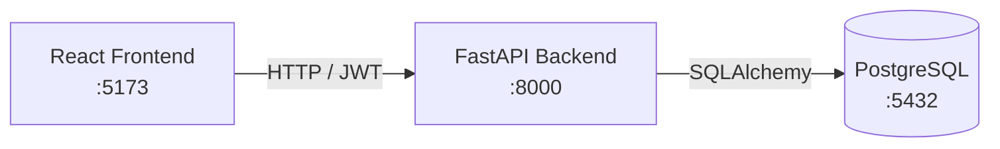

# Splitwise-like

<!-- ## Screenshots

| Dashboard | Group Details |
|-----------|--------------|
|  |  | -->

A full-stack expense-sharing application built with FastAPI and React, inspired by Splitwise.

## What Is This

A Splitwise-inspired expense-sharing app. Users can register, create groups, invite members, record shared expenses, and automatically compute net balances and optimal settlement suggestions within a group.

**Core Features**

- User registration / login (JWT-based authentication)
- Group creation and member invites
- Shared expense tracking and splitting
- Per-group balance calculation
- Debt simplification (minimum-transfer settlement suggestions)

---

## Tech Stack

| Layer | Technologies |
|-------|--------------|
| Backend | FastAPI, SQLAlchemy, Alembic, JWT |
| Frontend | React, TypeScript, Vite, React Query, Tailwind CSS |
| Database | PostgreSQL 16 |
| Infrastructure | Docker, Docker Compose, GitHub Actions |

---

## Architecture



**Backend Layers**

```
Routes → Service → Repository → Database
```
- **Routes**: request validation and HTTP responses
- **Service**: business logic and authorization checks
- **Repository**: database access abstraction
- **Database**: PostgreSQL persistence layer

---

## Local Development

**Prerequisites:** Python 3.12, Node.js, Docker Desktop

Configure `.env` under `backend/` (see existing fields):

```
POSTGRES_USER=
POSTGRES_PASSWORD=
POSTGRES_DB=
DATABASE_URL=postgresql://<user>:<password>@localhost:5432/<db>
SECRET_KEY=
ALGORITHM=HS256
```

First-time setup — install dependencies:

```bash
# Backend
cd backend
python -m venv venv
venv\Scripts\activate        # Windows
pip install -r requirements.txt
alembic upgrade head

# Frontend
cd frontend
npm install
```

Start the app across **three terminals**, in order:

**Terminal 1 — Database**

```bash
cd backend
docker compose up db
```

**Terminal 2 — Backend API**

```bash
cd backend
venv\Scripts\activate
uvicorn app.main:app --reload
```

**Terminal 3 — Frontend**

```bash
cd frontend
npm run dev
```

| Service | URL |
|---------|-----|
| Frontend | http://localhost:5173 |
| Backend API | http://127.0.0.1:8000 |
| Swagger UI | http://127.0.0.1:8000/docs |

> **Windows note:** The frontend API client uses `127.0.0.1` instead of `localhost` to avoid IPv6 resolution hitting the Docker container and causing CORS errors. For local dev, run only the `db` container and start the backend with uvicorn directly.

**Docker one-command start (optional)**

```bash
cd backend
docker compose up --build
```

---

## API Documentation

Full endpoint reference: [backend/docs/api.md](backend/docs/api.md)

Interactive docs: http://127.0.0.1:8000/docs

---

## Running Tests

```bash
cd backend
venv\Scripts\activate
pytest
```

Tests use an isolated SQLite configuration and do not require PostgreSQL.

Tests include:
- Authentication workflow
- Group creation workflow
- Member invitation workflow
- Expense / balance / settlement workflow
- Authorization and permission checks

CI runs pytest, Ruff, and Docker build verification on every push and pull request.

---

## Future Improvements

### Product Features
- Edit / delete expenses
- Multiple split modes (equal, percentage, custom)
- Multi-currency support
- Email verification

### Engineering
- Redis caching
- WebSocket real-time updates
- Kubernetes deployment
- Observability (Prometheus + Grafana)
